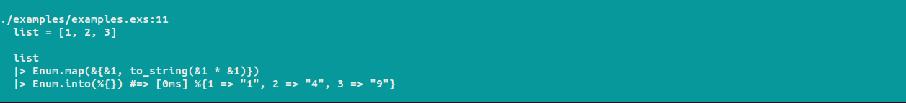
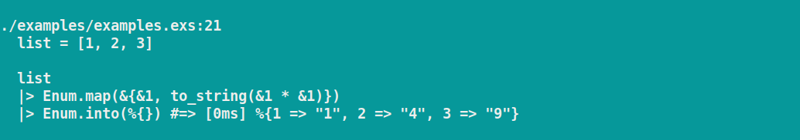
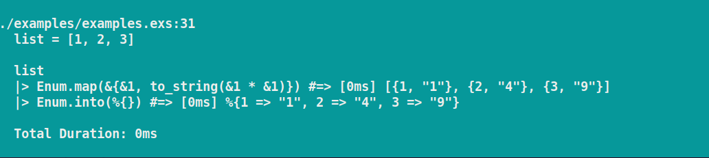

# Examine

Examine enhances Elixir `IO.inspect` debugging by displaying results alongside code and execution times. When used with pipelines, it can show the results and execution time for each step, along with the overall execution time and the pipeline code.

The `Examine.inspect/2` macro only affects the `:dev` environment by default.

Documentation can be found at [https://hexdocs.pm/examine](https://hexdocs.pm/examine).

## Installation

Add `:examine` to your list of dependencies in `mix.exs`:

```elixir
def deps do
  [
    {:examine, "~> 0.1.0"}
  ]
end
```

## Examples

### Simple Usage
```elixir
Examine.inspect(1 + 2)
```


### Pipeline and Vars
```elixir
list = [1, 2, 3]

list
|> Enum.map(&{&1, to_string(&1 * &1)})
|> Enum.into(%{})
|> Dbg.inspect(show_vars: true)
```


### Inspecting a Pipeline
```elixir
list = [1, 2, 3]

    list
    |> Enum.map(&{&1, to_string(&1 * &1)})
    |> Enum.into(%{})
    |> Examine.inspect(inspect_pipeline: true, show_vars: true)
```


### Inspecting a Pipeline with Anonymous Function
```elixir
list = [1, 2, 3]

    list
    |> Enum.map(&{&1, to_string(&1 * &1)})
    |> (fn val ->
          :timer.sleep(1000)
          val
        end).()
    |> Enum.into(%{})
    |> Examine.inspect(inspect_pipeline: true)
```


## Acknowledgements

https://github.com/romul/dbg_inspect
