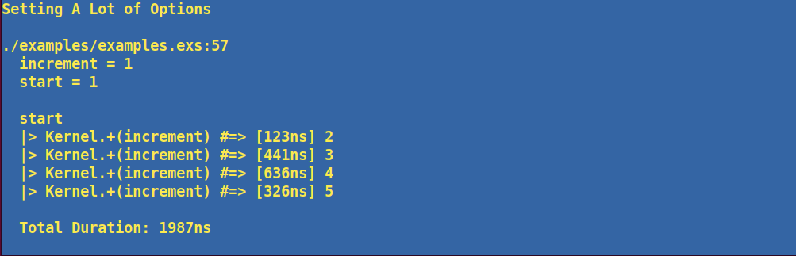

# Examine

Examine enhances Elixir `IO.inspect` debugging by displaying results alongside code and execution times.

## Additional Features
* Prints reprensentation of expression passed as the first argument
* For pipelines, prints file code
* Prints results and execution times for each step in a pipeline
* Prints total execution time for a multi-step pipeline
* Prints filename and line number from where `Examine.inspect/2` was called
* Option to print all the variables within the context where `Examine.inspect/2` was called
* Optionally print a label at the top
* Global configuration and local options for colors and time units

The `Examine.inspect/2` macro only affects the `:dev` environment by default and will compile to a noop in other environments. The affected environments can be changed via config.

Documentation can be found at [https://hexdocs.pm/examine](https://hexdocs.pm/examine).

## Installation

Add `:examine` to your list of dependencies in `mix.exs`:

```elixir
def deps do
  [
    {:examine, "~> 0.1.0"}
  ]
end
```

Require the `Examine` module wherever you want to use it:

```elixir
defmodule SomeModule
  require Examine

  def one_plus_two do
    Examine.inspect(1 + 2)
  end
end
```

## Examples

### Simple Usage
```elixir
Examine.inspect(1 + 2)
```


### Pipeline and Vars
```elixir
list = [1, 2, 3]

list
|> Enum.map(&{&1, to_string(&1 * &1)})
|> Enum.into(%{})
|> Examine.inspect(show_vars: true)
```


### Inspecting a Pipeline
```elixir
list = [1, 2, 3]

list
|> Enum.map(&{&1, to_string(&1 * &1)})
|> Enum.into(%{})
|> Examine.inspect(inspect_pipeline: true, show_vars: true)
```


### Inspecting a Pipeline with Anonymous Function
```elixir
list = [1, 2, 3]

list
|> Enum.map(&{&1, to_string(&1 * &1)})
|> (fn val ->
      :timer.sleep(1000)
      val
    end).()
|> Enum.into(%{})
|> Examine.inspect(inspect_pipeline: true)
```


### Setting Various Options
```elixir
start = 1
increment = 1

start
|> Kernel.+(increment)
|> Kernel.+(increment)
|> Kernel.+(increment)
|> Kernel.+(increment)
|> Examine.inspect(
  inspect_pipeline: true,
  color: :yellow,
  bg_color: :blue,
  show_vars: true,
  time_unit: :nanosecond,
  label: "Setting A Lot of Options"
)
```


## Acknowledgements

https://github.com/romul/dbg_inspect
